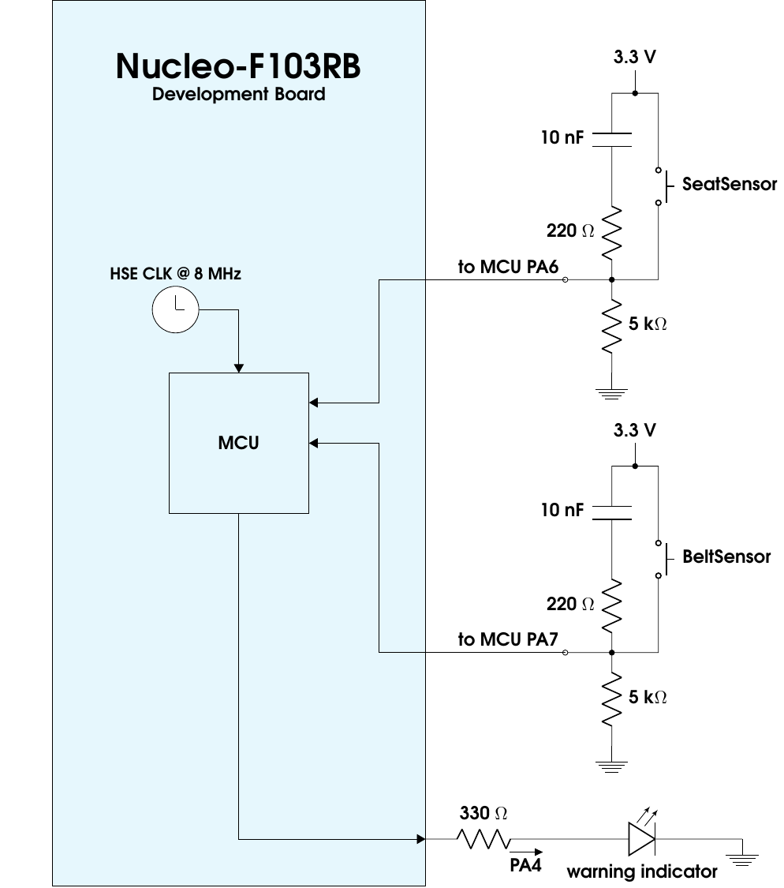
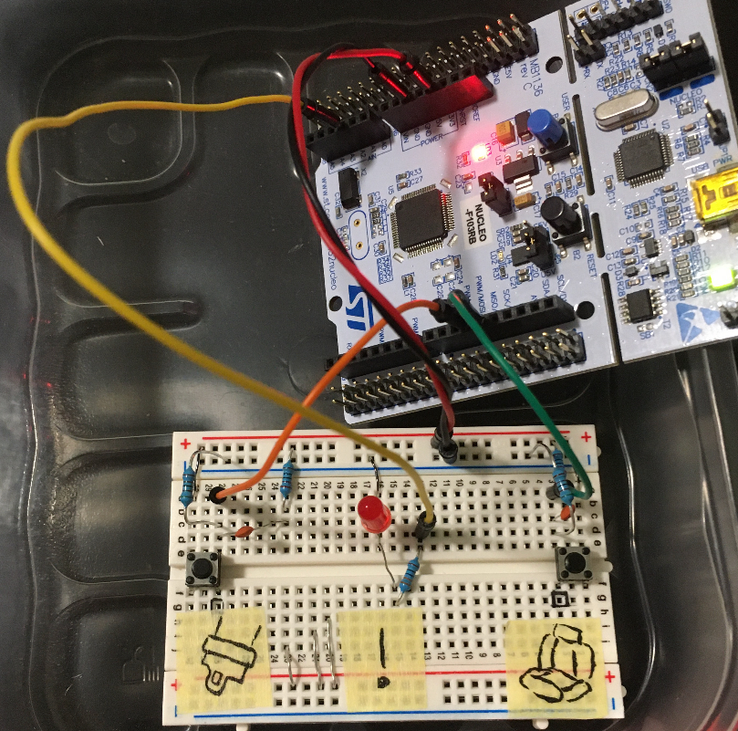
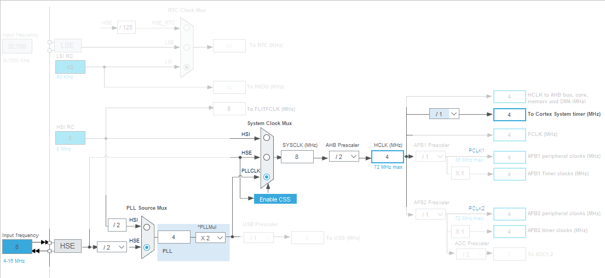

# Seatbelt Reminder System
Welcome to this small-scale embedded project!

## Functionality of the Seatbelt Reminder System

This project is extended from a textbook example that demonstrates the utility of ***state machine modeling*** in many ***embedded development***.  

Basically, the system in question reminds drivers or occupants in a vehicle to buckle up. It is expected a passenger/ driver should buckle up within certain amount of time (we are considering neither the case of reversing nor a parked vehicle).  If you remain seated for longer than that amount of time (A) without fastening your seat belt, you will receive a gentle reminder signal (B). Of course, this signal should go off after you buckle up or if for some reason[^1], you leave the seat.

For the sack of demonstration, these are specified as:

* (A): allowed duration of 6 sec from sitting to fastening seatbelt without triggering a reminder/ warning signal.
* (B): the signal is simply a red LED indicator.

The use of state machine paradigm in such project is detailed in the [documentation](doc/doc.pdf).

[^1]: maybe the vehicle in question is a coach owned by a very safety-conscious operator that are concerned with the case when you forget to fasten your seatbelt after visiting the rest room.

## Description of the target hardware

### The microcontroller (MCU)

The target used for the demonstration is STM32F103RB which features a popular 32-bit ARM Cortex M3 core, a very interesting Nested Vector Interrupt mechanism (not explored in this project *yet*), 128 kB of Flash and 20 kB of SRAM. For this project, the corresponding Nucleo-64 development board is used.

Obviously, this would be quite an overkill for the aforementioned embedded task *alone*. I chose this target simply because it was the only one I currently had. As such, you can port the state machine handler code to almost any targets[^2] after some minor modifications, in particular:

* reconfiguring the pins (or use HAL instead),

* the clock tree & counter value calculations, and

* making appropriate changes to the handler code (namely matching the ISR label in your linker script, and additional keywords if needed).

  

  [^2]: In fact, for this simple project,  it might make sense to just implement the state machine using elementary digital electronic circuits. Another merit of adopting state machine  modeling is that this implementation is also straight forward! (you may need to reconsider the system I/O due to the timer though.)

### I/O setup

For the purpose of the prototyping, the sensors are modeled as simple push buttons as shown below.





### Clock & Timing 

<span id="timing"> Since we have explicitly require a certain time delay of 6 sec,</span> some sort of counters driven by some clock is needed.

I adopt the following approach for the state machine model: 

* the state machine is updated frequently enough, say every 0.5 ms.
* the state machine is executed during servicing the *SysTick Handler* (which is arguably the simplest option for implementing a periodic interrupt in ARM Cortex-based MCUs.)
  As such, the *SysTick* IRQ should arrives every 0.5 ms.
* The duration from sitting to buckling up (which should not exceed 6 sec) should be tracked by a *static* counter that survives each ISR invocation, and incremented when appropriate by the *same* ISR. 
  As such, the 6 sec translates into (6 sec/ 0.5 ms ) = 12000 counts.

To effect the *SysTick IRQ  interval* to the desired 0.5 ms, I decided the followings for my STM32F103xxx target:

* use the on-board 8-MHz quartz source to drive the on-chip PLL @ 8 MHz which is selected as the *System Clock*  which in turn drives the *SysTick* timer @ 4 MHz. 
  The clock tree configuration below was captured from STM32CubeMX.
  
  

  

  (More details on e.g. the bit field encoding of RCC's Configuration Register can be found in [this file](startup-Clock-setup-info.txt). In any case, please also consult our vendor manual.)

* The *AutoReload* value of the *SysTick* is configured correspondingly as
  (0.5 ms * 4 MHz) - 1 = 1999 [unit time between *SysTick IRQ* arrivals]

  (see the `#define SysTimerInterval_ticks 2000` in [the application source file](app.c).)

## Development environment

[GNU Arm Embedded Toolchain](https://developer.arm.com/tools-and-software/open-source-software/developer-tools/gnu-toolchain/gnu-rm/downloads) is used throughout this project which is available in the provided hyperlink. The version I used is Version 9-2020-q2 which should not really matter much for this project.

To build the project run:

```makefile
make build
```

then load it to the flash by

```makefile
make load
```

and have fun!

## BSD 2-Clause License

Copyright (c) 2020 lkmuk. All rights reserved.      

Redistribution and use in source and binary forms, with or without modification, are permitted provided that the following conditions are met:

1. Redistributions of source code must retain the above copyright notice, this list of conditions and the following disclaimer.        
2. Redistributions in binary form must reproduce the above copyright notice, this list of conditions and the following disclaimer in the documentation and/or other materials provided with the distribution.        

THIS SOFTWARE IS PROVIDED BY  lkmuk "AS IS" AND ANY IMPLIED WARRANTIES, INCLUDING, BUT NOT LIMITED TO, THE IMPLIED WARRANTIES OF MERCHANTABILITY AND FITNESS FOR A PARTICULAR PURPOSE ARE DISCLAIMED. IN NO EVENT SHALL lkmuk BE LIABLE FOR ANY DIRECT, INDIRECT, INCIDENTAL, SPECIAL, EXEMPLARY, OR CONSEQUENTIAL DAMAGES (INCLUDING, BUT NOT LIMITED TO, PROCUREMENT OF SUBSTITUTE GOODS OR SERVICES; LOSS OF USE, DATA, OR PROFITS; OR BUSINESS INTERRUPTION) HOWEVER CAUSED AND ON ANY THEORY OF LIABILITY, WHETHER IN CONTRACT, STRICT LIABILITY, OR TORT (INCLUDING NEGLIGENCE OR OTHERWISE) ARISING IN ANY WAY OUT OF THE USE OF THIS SOFTWARE, EVEN IF ADVISED OF THE POSSIBILITY OF SUCH DAMAGE.      

## Feedback wanted

I hope the contents are also interesting to you. In case of bug error, or other comments in general, please let me know!